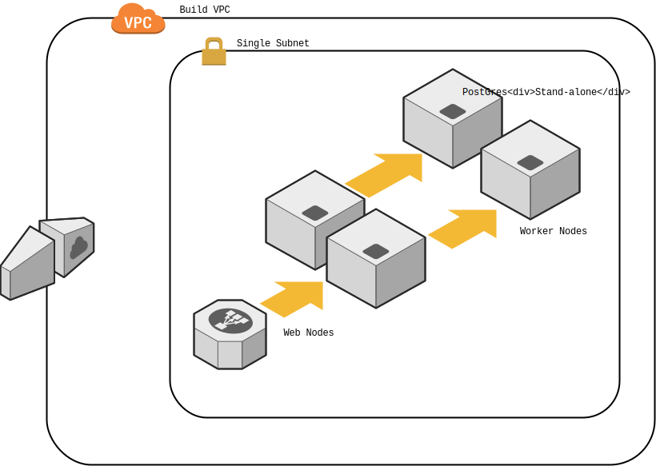

# Concourse on AWS via Terraform

[](https://waffle.io/7Factor/7fpub-aws-concourse)

This module will allow you to publish concourse on your own AWS infrastructure. Why another module? We needed something a little more prescriptive than the current module that's available (don't get us wrong, it's great).

Currently we supports the following features:

1. Docker based deployment. The module uses the most recent ECS AMI for deployment.
2. Configurable number of workers and webs along with volume sizes and instance types.
3. Supports AWS classic load balancing complete with SSL termination.
4. Configurable authentication scheme (you need to know what you're doing though).
5. Configurable PostGres installation because you don't need RDS for this. It's way cheaper.

See the examples directory for more information on how to deploy this to your account. You shouldn't need to this very much. Check ```variables.tf``` for information on all the bits you'll need and also see the ```main.tf``` in the root directory for an example of how to call the module.

## Prerequisites

First, you need a decent understanding of how to use Terraform. [Hit the docs](https://www.terraform.io/intro/index.html) for that. Then, you should understand the [concourse architecture](http://concourse.ci/architecture.html). Once you're good there clone this repository and build out your ```.tfvars``` file. Then, plan your run and deploy. Not much can go wrong here, but [file issues](https://github.com/7Factor/7fpub-aws-concourse/issues) as you need to. Be sure to read our [issues guide](https://7factor.github.io/7fpub-ghissues/) before hand please.

